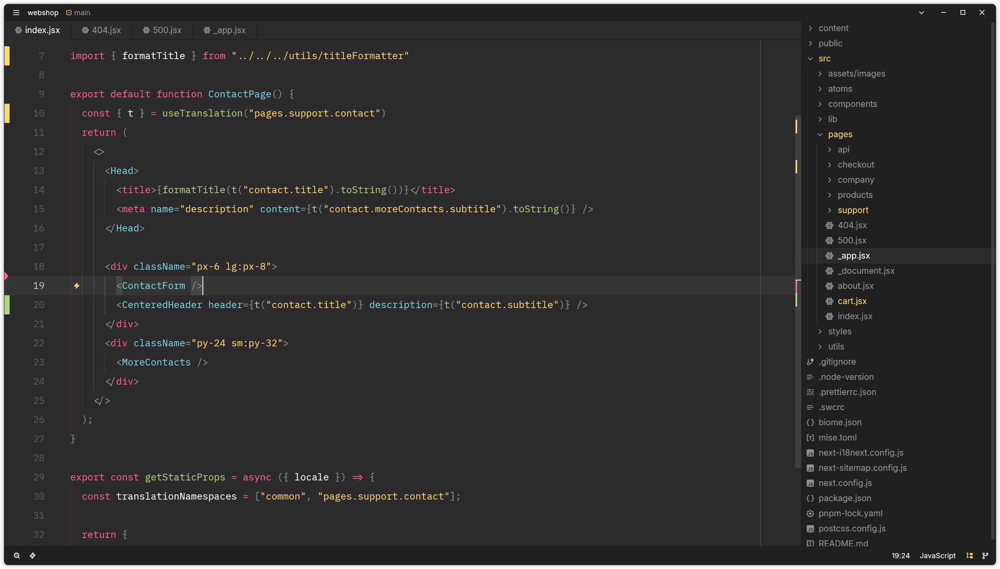

# Kaiokai for [Zed](https://zed.dev/)

## About

`Kaiokai` is an unofficial theme collection for [Zed](https://zed.dev/) inspired by the [Monokai Pro](https://monokai.pro) color scheme.

This public repo ships only the Zed theme JSON and packaging needed to use the theme.

The project is maintained by [Kai Kozlov](https://github.com/kaikozlov).

It started from the community `zed-monokai-pro-ce` effort, but the implementation here is maintained independently and is not part of the Monokai Pro Community Edition line.

## Included Themes

Dark:
- Kaiokai
- Kaiokai Classic
- Kaiokai (Filter Machine)
- Kaiokai (Filter Octagon)
- Kaiokai (Filter Ristretto)
- Kaiokai (Filter Spectrum)

Light:
- Kaiokai Light
- Kaiokai Light (Filter Sun)

[Installation instructions](INSTALL.md)

[MIT License](LICENSE.md)
